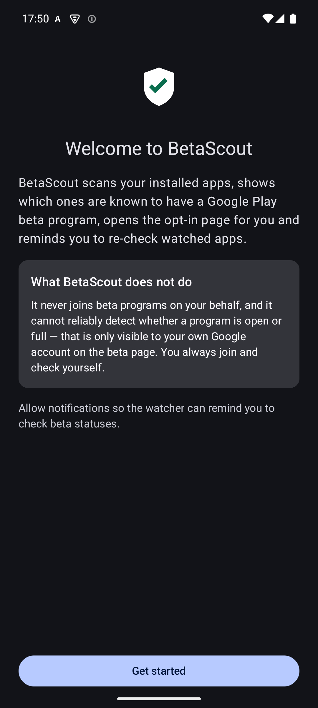
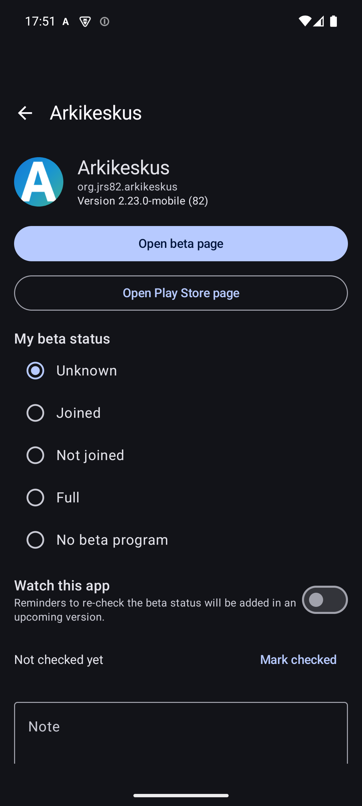
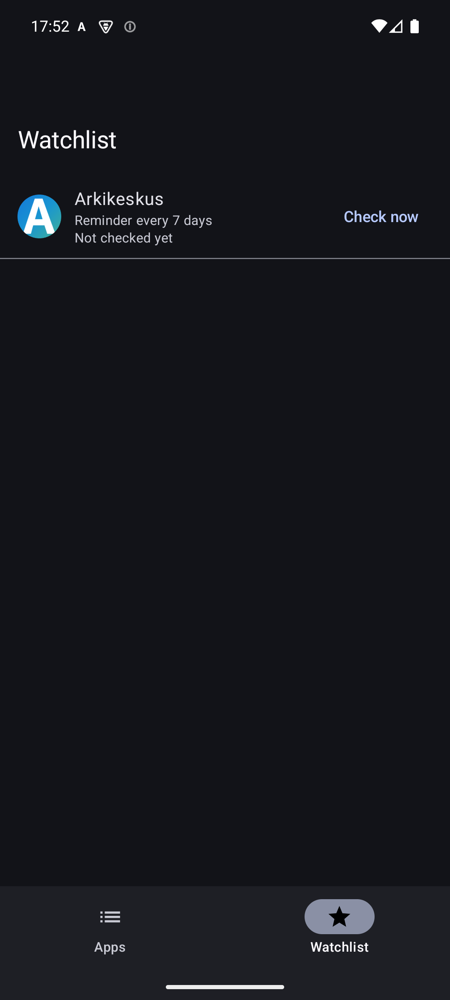

# BetaScout

[](https://github.com/jrs8205/BetaScout/actions/workflows/ci.yml)
[](LICENSE)

**Find and track Google Play beta programs for the apps on your device.**

BetaScout scans your installed apps, shows which ones are known to have a Google Play
open-testing (beta) program, opens the opt-in page for you, and reminds you to re-check
the ones you are watching — so you catch a free slot when one opens up.

The app is fully bilingual: **English** and **Finnish** (suomi).

## What it does

- 📋 **Scans installed apps** — name, icon, version and install source, entirely on-device
- 🔍 **Knows about beta programs** — a curated, bundled database marks apps with known
  open-testing programs ("usually open" / "usually full")
- 🔗 **One-tap deep links** — open an app's `play.google.com/apps/testing/…` opt-in page
  or its Play Store page directly
- ✍️ **Track your own status** — mark each app as joined / not joined / full / no program,
  and keep private notes
- ⏰ **Watchlist with reminders** — watch apps you care about and get a notification at
  your chosen interval (7/14/30 days) reminding you to re-check; tapping it opens the
  beta page

## What it does *not* do

Honesty first:

- It **never joins a beta program on your behalf.** Joining requires pressing the *Join*
  button on Google Play yourself.
- It **cannot reliably detect whether a program is open or full.** That information is
  only visible to your own signed-in Google account on the testing page, so BetaScout
  helps you get there instead of guessing.
- No accessibility-service automation, no APK sideloading, no Play Store bypassing.

## Screenshots

| Onboarding | App details | Watchlist |
|:---:|:---:|:---:|
|  |  |  |

## Installation

BetaScout is distributed as an APK via [GitHub Releases](https://github.com/jrs8205/BetaScout/releases)
— it is **not** on the Play Store.

1. Download the latest APK from the Releases page.
2. Allow installs from unknown sources when Android asks.
3. Done — the app works fully offline.

> **Why not the Play Store?** BetaScout uses the `QUERY_ALL_PACKAGES` permission to list
> everything installed on your device. That permission is heavily restricted on the Play
> Store, but it is exactly what makes the app useful — so it lives here instead.

## Permissions

| Permission | Why |
|---|---|
| `QUERY_ALL_PACKAGES` | List your installed apps — the whole point of the app |
| `POST_NOTIFICATIONS` | Watchlist reminders (asked on first launch, Android 13+) |

No internet permission. Nothing leaves your device.

## Building from source

Requirements: JDK 17+ and the Android SDK (or just Android Studio).

```bash
git clone https://github.com/jrs8205/BetaScout.git
cd BetaScout
./gradlew assembleDebug   # APK at app/build/outputs/apk/debug/
./gradlew test            # unit tests
```

## Tech stack

Kotlin · Jetpack Compose (Material 3) · MVVM + Repository · Room · DataStore ·
WorkManager · Hilt · Navigation-Compose · kotlinx-serialization

- minSdk 26 (Android 8.0) · targetSdk 36
- Core logic is unit-tested (TDD): link building, package scanning, seed parsing,
  repository behavior, list filtering and reminder scheduling policy

## Roadmap

- [ ] Experimental, opt-in web check of testing pages (best effort — see honesty note above)
- [ ] Community-sourced beta-program database

Suggestions and bug reports are welcome in [Issues](https://github.com/jrs8205/BetaScout/issues).

## License

Licensed under the [Apache License 2.0](LICENSE).
